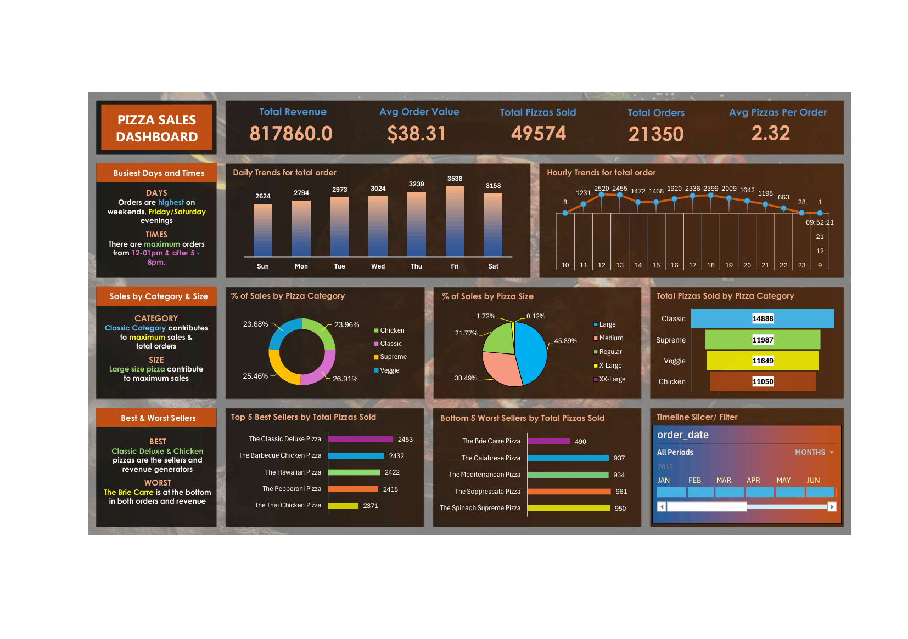
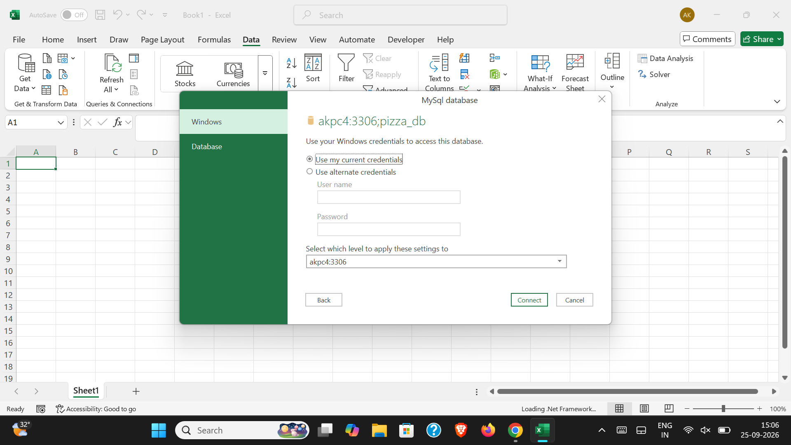

# 🍕 Pizza Sales — SQL + Excel Dashboard

An end-to-end analysis of ~48K pizza order line items (Jan–Dec 2015) using
MySQL for aggregation and Excel for visualization — built to satisfy a
defined set of KPI and charting requirements (see
[`business_requirements.txt`](business_requirements.txt)).

---

## 📊 Preview



Data pulled into Excel via a live MySQL connection:



---

## 🧠 What this project is

A retail sales analysis built on raw pizza order data, designed around a
brief of 5 KPI requirements and 7 chart requirements (daily/hourly order
trends, category and size sales share, category-wise pizza volume, and
best/worst sellers). The full requirements are in
[`business_requirements.txt`](business_requirements.txt).

## 🛠️ How I built it

**Source data:** `pizza_sales.csv` — one row per pizza line item in an
order: `pizza_id`, `order_id`, `pizza_name_id`, `quantity`, `order_date`,
`order_time`, `unit_price`, `total_price`, `pizza_size`, `pizza_category`,
`pizza_ingredients`, `pizza_name`.

**Pipeline:**
1. Loaded the raw CSV into a MySQL table (`pizza_sales`).
2. Wrote and ran the analysis queries in
   [`pizza_sales_queries.sql`](pizza_sales_queries.sql) directly against
   MySQL to answer every KPI and chart requirement.
3. Connected Excel to the MySQL database (Data → Get Data → From
   Database → MySQL) and pulled the raw table in live.
4. Cleaned the pulled data in Excel and built calculation sheets that
   mirror the SQL queries, then charted each onto a single dashboard
   sheet.

**Key SQL queries (`pizza_sales_queries.sql`):** total revenue, average
order value, total pizzas sold, total orders, average pizzas per order,
daily order trend by weekday, hourly order trend, % of sales by category,
% of sales by size, total pizzas sold by category, top 5 and bottom 5
sellers by quantity.

**Tools used:** MySQL (data storage + aggregation queries), Excel (Get
Data/Power Query, PivotTables, charts, dashboard layout).

---

## 📁 Repo contents

```
├── pizza_sales.csv                               # Source transaction data
├── pizza_sales_queries.sql                       # MySQL queries answering every KPI/chart requirement
├── Pizza sales excel cleaning and dashboard.xlsx  # Cleaned data, calc sheets, and final dashboard
├── business_requirements.txt                     # KPI & chart requirements this project satisfies
├── screenshots/
│   ├── dashboard.png                             # Final Excel dashboard
│   └── mysql_data_load.png                       # Excel connecting to the MySQL database
└── README.md
```
